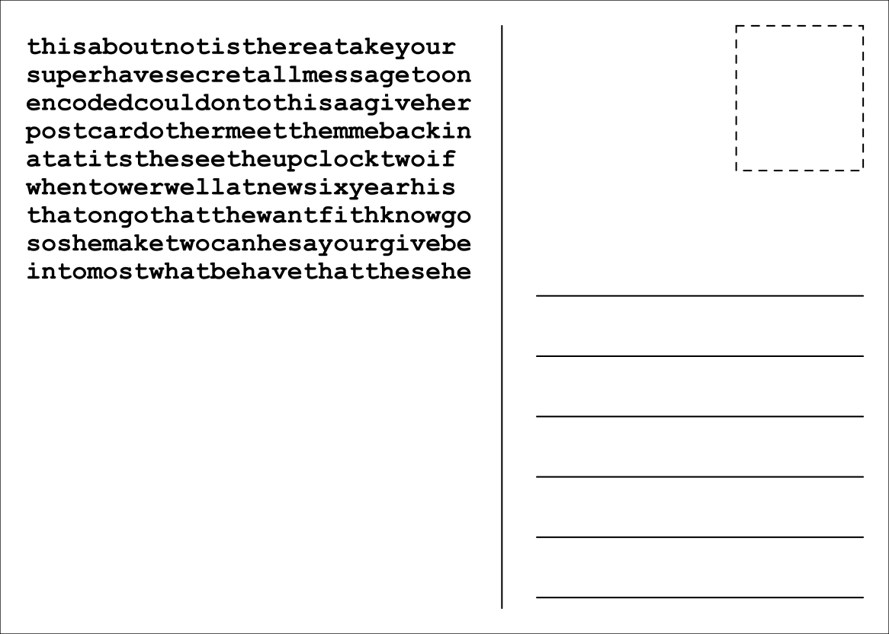
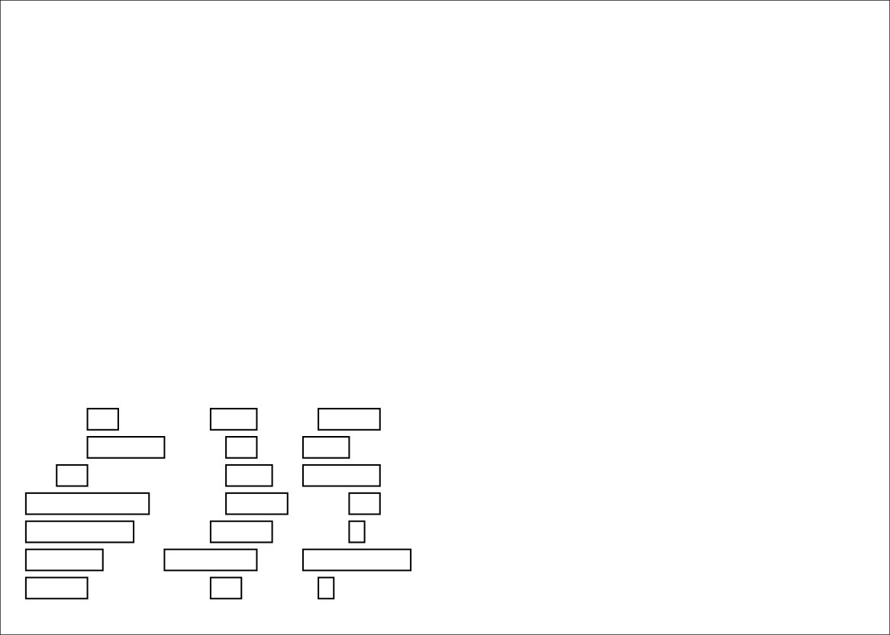
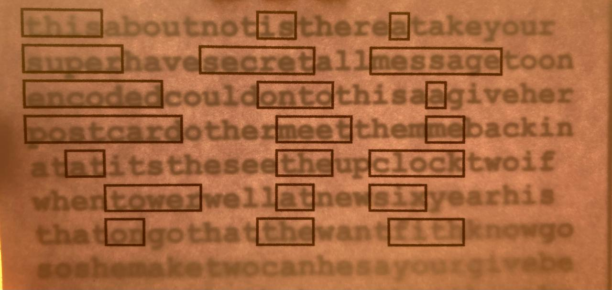

# Post Card Grille

## Generates printable postcards with a grille cipher.

The default operation is to create a postcard that needs to be folded first before holding it up to the light. This theoretically shows you that the message has been read. When the boxes are on the back of the post card they could be integrated into a design.

### Why this is a bad cipher

- Steganography is the practice of concealing a message within other data. A grille cipher is a good example of this when the message is hidden in normal looking text and an observer does not suspect the presence of a hidden message. The text used in this example is random and does not follow usual writing structures. It is also accompanied by the grille which implies a message is hidden within.
- The grille is sent with the text. Usually the text and the grille are stored or send separately
- A limited length of message can be sent. The space for the text is only a quarter of the postcard. The longer the message, the more of the text is the message and the easier it is to read. If the post card is not folded then twice as much text can be written. The text size can also be decreased to fit more text on the card, at the price of legibility

## Usage

The post card can be held up to the light in order to view the message.

When the fold flag is set to true, the post card will look like this:

The grille pattern should be printed on the back of the postcard. The Post Card is then folded in half and then held up to the light to view the message.

The front will look like this:

The back will look like this:

After folding, the post card looks like this over a light:

