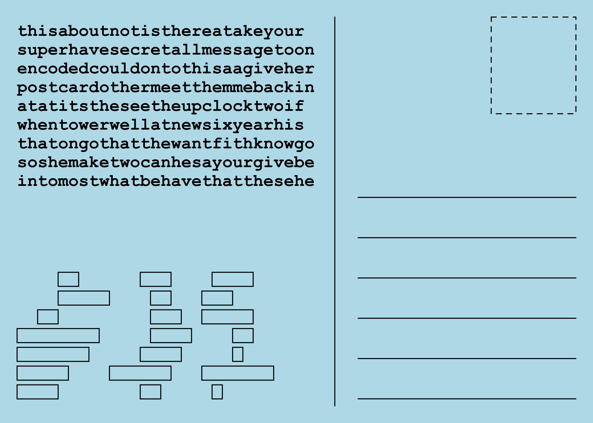

# Post Card Grille

## Generates printable postcards with a grille cipher.

The post card can be held up to the light in order to view the message.

When the fold flag is set to true, the post card will look like this:

The grille pattern should be printed on the back of the postcard. The Post Card is then folded in half and then held up to the light to view the message.

The front will look like this:

The back will look like this:

After folding the post card looks like this over a light:

